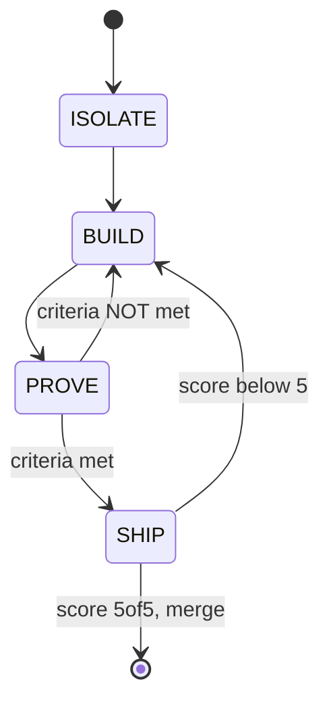

# Context Management

Context is the most critical resource in a Claude Code session. Manage it actively.

## File-Backed State (Primary Strategy)

**The file is the memory, not the conversation.** Conversations are ephemeral and
will be compacted or lost. Files on disk persist across compactions and session crashes.

### Session State File

Maintain `production/session-state/active.md` as a living checkpoint. Update it
after each significant milestone:

- Design section approved and written to file
- Architecture decision made
- Implementation milestone reached
- Test results obtained

The state file should contain: current task, progress checklist, key decisions
made, files being worked on, and open questions.

For implementation work it MUST also contain the Software Factory phase block:

```markdown
sf_phase: BUILD
sf_worktree: ../wts/melee-hitbox
sf_branch: feat/melee-hitbox
sf_prove_evidence:
  screenshots: [tests/evidence/before.png, tests/evidence/after.png]
  metrics: { fps: 60, memory: 45MB, coverage: 87pct }
  test_results: tests/results/prove.json
sf_ship_review:
  reviewer: greptile
  score: 4
  feedback: Missing null-check line 42
  loop_count: 2
```

- sf_phase is required: ISOLATE, BUILD, PROVE, or SHIP.
- sf_prove_evidence required before SHIP, paths MUST exist.
- sf_ship_review loop_count caps at 3.

### Status Line Block (Production+ only)

When the project is in Production, Polish, or Release stage, include a structured
status block in `active.md` that the status line script can parse:

```markdown
<!-- STATUS -->
Epic: Combat System
Feature: Melee Combat
Task: Implement hitbox detection
SF_Phase: PROVE
SF_Loop: 2/3
<!-- /STATUS -->
```

- All three fields (Epic, Feature, Task) are optional — include only what applies
- Update this block when switching focus areas
- The status line displays it as a breadcrumb: `Combat System > Melee Combat > Hitboxes`
- Remove or empty the block when no active work focus exists

After any disruption (compaction, crash, `/clear`), read the state file first.

### Incremental File Writing

When creating multi-section documents (design docs, architecture docs, lore entries):

1. Create the file immediately with a skeleton (all section headers, empty bodies)
2. Discuss and draft one section at a time in conversation
3. Write each section to the file as soon as it's approved
4. Update the session state file after each section
5. After writing a section, previous discussion about that section can be safely
   compacted — the decisions are in the file

This keeps the context window holding only the *current* section's discussion
(~3-5k tokens) instead of the entire document's conversation history (~30-50k tokens).

## Proactive Compaction

- **Compact proactively** at ~60-70% context usage, not reactively at the limit
- **Use `/clear`** between unrelated tasks, or after 2+ failed correction attempts
- **Natural compaction points:** after writing a section to file, after committing,
  after completing a task, before starting a new topic
- **Focused compaction:** `/compact Focus on [current task] — sections 1-3 are
  written to file, working on section 4`

## Context Budgets by Task Type

- Light (read/review): ~3k tokens startup
- Medium (implement feature): ~8k tokens
- Heavy (multi-system refactor): ~15k tokens

## Subagent Delegation

Use subagents for research and exploration to keep the main session clean.
Subagents run in their own context window and return only summaries:

- **Use subagents** when investigating across multiple files, exploring unfamiliar code,
  or doing research that would consume >5k tokens of file reads
- **Use direct reads** when you know exactly which 1-2 files to check
- Subagents do not inherit conversation history — provide full context in the prompt

## Compaction Instructions

When context is compacted, preserve the following in the summary:

- Reference to `production/session-state/active.md` (read it to recover state)
- List of files modified in this session and their purpose
- Any architectural decisions made and their rationale
- Active sprint tasks and their current status
- Agent invocations and their outcomes (success/failure/blocked)
- Test results (pass/fail counts, specific failures)
- Unresolved blockers or questions awaiting user input
- The current task and what step we are on
- Which sections of the current document are written to file vs. still in progress

**After compaction:** Read `production/session-state/active.md` and any files being
actively worked on to recover full context. The files contain the decisions; the
conversation history is secondary.

## Recovery After Session Crash

If a session dies ("prompt too long") or you start a new session to continue work:

1. The `session-start.sh` hook will detect and preview `active.md` automatically
2. Read the full state file for context
3. Read the partially-completed file(s) listed in the state
4. Continue from the next incomplete section or task

## Software Factory State Machine



1. Read sf_phase from active.md.
2. Resume FROM THAT PHASE, never restart from ISOLATE.
3. If sf_phase SHIP and score below 5, load feedback and resume at BUILD.
4. Invalid: ISOLATE to SHIP, ISOLATE to PROVE, BUILD to SHIP.

