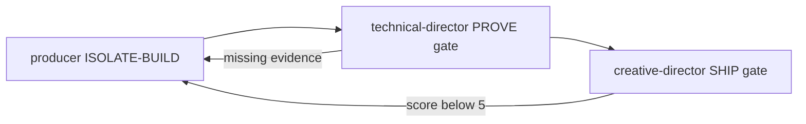

# Agent Coordination Rules

1. **Vertical Delegation**: Leadership agents delegate to department leads, who
   delegate to specialists. Never skip a tier for complex decisions.
2. **Horizontal Consultation**: Agents at the same tier may consult each other
   but must not make binding decisions outside their domain.
3. **Conflict Resolution**: When two agents disagree, escalate to the shared
   parent. If no shared parent, escalate to `creative-director` for design
   conflicts or `technical-director` for technical conflicts.
   Workflow Violation (skipped ISOLATE, missing PROVE evidence, SHIP without
   5/5) auto-escalates: ISOLATE/BUILD violations to producer;
   PROVE/SHIP violations to technical-director.
4. **Change Propagation**: When a design change affects multiple domains, the
   `producer` agent coordinates the propagation.
5. **No Unilateral Cross-Domain Changes**: An agent must never modify files
   outside its designated directories without explicit delegation.

## Model Tier Assignment

Skills and agents are assigned to model tiers based on task complexity:

| Tier | Model | When to use |
|------|-------|-------------|
| **Haiku** | `claude-haiku-4-5-20251001` | Read-only status checks, formatting, simple lookups — no creative judgment needed |
| **Sonnet** | `claude-sonnet-4-6` | Implementation, design authoring, analysis of individual systems — default for most work |
| **Opus** | `claude-opus-4-6` | Multi-document synthesis, high-stakes phase gate verdicts, cross-system holistic review |

Skills with `model: haiku`: `/help`, `/sprint-status`, `/story-readiness`, `/scope-check`,
`/project-stage-detect`, `/changelog`, `/patch-notes`, `/onboard`

Skills with `model: opus`: `/review-all-gdds`, `/architecture-review`, `/gate-check`

All other skills default to Sonnet. When creating new skills, assign Haiku if the
skill only reads and formats; assign Opus if it must synthesize 5+ documents with
high-stakes output; otherwise leave unset (Sonnet).

## Subagents

This project uses subagents for task decomposition and isolation:

### Subagents (always active)
Spawned via `Task` within a single Claude Code session. Used by all `team-*` skills
and orchestration skills. Subagents share the session's permission context and
return results to the parent.

Each subagent runs independently with its own context window. Use them for
research, exploration, or isolated implementation tasks that don't require
intermediate user decisions.

## Software Factory Enforcement

Lead agents act as phase gatekeepers. Delegation MUST carry phase metadata.

1. producer, ISOLATE to BUILD owner. Blocks BUILD if no fresh worktree/branch and no sf_phase ISOLATE in active.md.
2. technical-director, PROVE gate owner. Rejects SHIP if sf_prove_evidence empty or paths missing.
3. creative-director, SHIP gate owner. Approves review-loop entry only if matches design.
4. Phase metadata in delegation. Every parent to subagent prompt MUST include phase tag.
5. Phase verdicts are Opus-tier. Same tier as gate-check.

